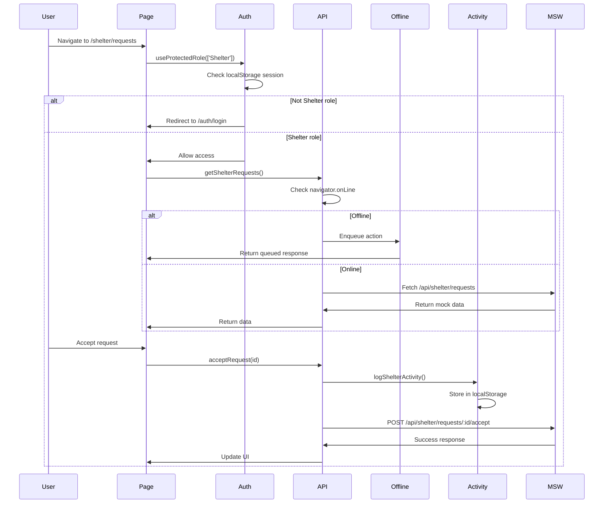

# Design Document: Shelter Module Integration

## Overview

This design document outlines the technical approach for integrating the Shelter module into the global application experience. The integration includes role-based route protection, unified navigation, activity logging, offline support, and MSW handler organization. The design leverages existing patterns in the codebase while introducing new utilities for authentication and offline queue management.

## Architecture

### High-Level Architecture

```
┌─────────────────────────────────────────────────────────────┐
│                     Application Layer                        │
│  ┌──────────────┐  ┌──────────────┐  ┌──────────────┐      │
│  │   Shelter    │  │   Shelter    │  │   Shelter    │      │
│  │  Dashboard   │  │   Requests   │  │  Residents   │      │
│  └──────────────┘  └──────────────┘  └──────────────┘      │
│  ┌──────────────┐                                           │
│  │   Shelter    │                                           │
│  │   Medical    │                                           │
│  └──────────────┘                                           │
└─────────────────────────────────────────────────────────────┘
                            ↓
┌─────────────────────────────────────────────────────────────┐
│                   Integration Layer                          │
│  ┌──────────────┐  ┌──────────────┐  ┌──────────────┐      │
│  │     Auth     │  │   Activity   │  │   Offline    │      │
│  │  Protection  │  │    Logging   │  │    Queue     │      │
│  └──────────────┘  └──────────────┘  └──────────────┘      │
└─────────────────────────────────────────────────────────────┘
                            ↓
┌─────────────────────────────────────────────────────────────┐
│                    Navigation Layer                          │
│  ┌──────────────────────────────────────────────────┐       │
│  │              Sidebar Component                    │       │
│  │  - Role-based link filtering                     │       │
│  │  - Active state management                       │       │
│  │  - Mobile responsive                             │       │
│  └──────────────────────────────────────────────────┘       │
└─────────────────────────────────────────────────────────────┘
                            ↓
┌─────────────────────────────────────────────────────────────┐
│                      Data Layer                              │
│  ┌──────────────┐  ┌──────────────┐  ┌──────────────┐      │
│  │     MSW      │  │  LocalStorage│  │  LocalForage │      │
│  │   Handlers   │  │   (Session)  │  │  (Activity)  │      │
│  └──────────────┘  └──────────────┘  └──────────────┘      │
└─────────────────────────────────────────────────────────────┘
```

### Component Interaction Flow



## Components and Interfaces

### 1. Authentication Module (`lib/auth.ts`)

**Purpose**: Provide role-based route protection for shelter pages.

**Interface**:
```typescript
// Session structure (existing in localStorage)
interface Session {
  token: string
  role: 'Volunteer' | 'NGO' | 'Admin' | 'Shelter'
  user: {
    id: string
    name: string
    email: string
  }
}

// Get current session
export function getSession(): Session | null

// Protected role hook
export function useProtectedRole(allowedRoles: string[]): void
```

**Implementation Details**:
- Reads session from `localStorage.getItem('session')`
- Uses Next.js `useRouter` for redirects
- Uses `useEffect` to check role on mount and route changes
- Redirects to `/auth/login` if role doesn't match

### 2. Activity Logging Module (`lib/activityLog.ts`)

**Purpose**: Log shelter-specific actions for audit and display.

**Enhanced Interface**:
```typescript
// Existing interface
export interface ActivityEvent {
  id: string
  type: string
  message: string
  timestamp: Date
  metadata?: any
}

// New shelter-specific function
export function logShelterActivity(message: string, metadata?: any): Promise<ActivityEvent | null>
```

**Implementation Details**:
- Extends existing `logActivity` function
- Adds `category: 'shelter'` to all shelter logs
- Stores in localforage with key `recent_activity`
- Maintains max 50 activities
- Used by RecentActivity widget on all dashboards

**Integration Points**:
- Accept request: `logShelterActivity('Accepted request for ${name}')`
- Reject request: `logShelterActivity('Rejected request for ${name}')`
- Add resident: `logShelterActivity('Added new resident: ${name}')`
- Add medical record: `logShelterActivity('Created medical record for ${name}')`
- Schedule follow-up: `logShelterActivity('Scheduled follow-up for ${name} on ${date}')`
- Complete follow-up: `logShelterActivity('Completed follow-up for ${name}')`

### 3. Offline Queue Module (`lib/offline.ts`)

**Purpose**: Queue shelter actions when offline and sync when online.

**Enhanced Interface**:
```typescript
// Existing interface
interface PendingRequest {
  id: string
  url: string
  method: string
  data: any
  timestamp: Date
}

// New shelter-specific function
export function enqueueShelterAction(action: {
  type: string
  endpoint: string
  method: string
  data: any
}): Promise<PendingRequest | null>

// Sync function (enhanced)
export function syncPendingQueue(): Promise<{
  success: boolean
  synced: number
  remaining: number
}>
```

**Implementation Details**:
- Extends existing `addToPendingQueue` function
- Stores in localforage with key `pending_sync_queue`
- Checks `navigator.onLine` before API calls
- Returns `{ queued: true }` for offline actions
- Syncs on app load and when online event fires
- Logs "Synced offline actions" to activity log after sync

### 4. API Module Enhancement (`lib/api.ts`)

**Purpose**: Add offline detection to shelter API calls.

**Enhanced Functions**:
```typescript
// Wrapper for offline-aware API calls
async function shelterApiRequest<T>(
  endpoint: string,
  options: RequestInit = {}
): Promise<T | { queued: true }>

// Enhanced shelter API functions
export async function acceptRequest(
  id: string,
  notes?: string
): Promise<{ success: boolean } | { queued: true }>

export async function rejectRequest(
  id: string,
  reason: string
): Promise<{ success: boolean } | { queued: true }>

export async function addShelterResident(
  data: Omit<ShelterResident, 'id' | 'dailyLogs'>
): Promise<ShelterResident | { queued: true }>

export async function createMedicalRecord(
  payload: Partial<MedicalRecord>
): Promise<MedicalRecord | { queued: true }>

export async function scheduleMedicalFollowup(
  recordId: string,
  payload: { date: string; notes?: string; residentId: string }
): Promise<MedicalFollowup | { queued: true }>

export async function toggleMedicalFollowupComplete(
  id: string,
  completed: boolean
): Promise<MedicalFollowup | { queued: true }>
```

**Implementation Details**:
- Check `navigator.onLine` before each request
- If offline, call `enqueueShelterAction` and return `{ queued: true }`
- If online, proceed with normal fetch
- Add activity logging after successful operations

### 5. Sidebar Component Enhancement (`components/Sidebar.tsx`)

**Purpose**: Display shelter-specific navigation links.

**Current State**: Already implemented with `SHELTER_NAV_LINKS` array.

**Verification Needed**:
- Ensure all icons are imported from `lucide-react`
- Verify active link highlighting works for all shelter routes
- Test mobile collapsible behavior
- Confirm hover animations work with framer-motion

**Links Configuration**:
```typescript
const SHELTER_NAV_LINKS = [
  { href: '/dashboard/shelter', labelKey: 'nav.dashboard', icon: Home, roles: ['Shelter'] },
  { href: '/shelter/requests', labelKey: 'nav.requests', icon: Inbox, roles: ['Shelter'] },
  { href: '/shelter/residents', labelKey: 'nav.residents', icon: Users, roles: ['Shelter'] },
  { href: '/shelter/medical', labelKey: 'nav.medical', icon: Stethoscope, roles: ['Shelter'] },
  { href: '/help', labelKey: 'nav.help', icon: HelpCircle, roles: ['Shelter'] },
  { href: '/settings', labelKey: 'nav.settings', icon: Settings, roles: ['Shelter'] },
]
```

### 6. MSW Handlers Organization (`mocks/browser.ts`)

**Purpose**: Unify all MSW handlers with proper ordering.

**Current State**: Already includes all shelter handlers.

**Handler Order** (Critical for preventing conflicts):
```typescript
export const worker = setupWorker(
  // 1. Auth handlers (highest priority)
  ...authHandlers,
  
  // 2. Shelter-specific handlers
  ...shelterHandlers,
  ...shelterRequestHandlers,
  ...shelterResidentsHandlers,
  ...shelterMedicalHandlers,
  
  // 3. Profile and resource handlers
  ...profileHandlers,
  ...resourceHandlers,
  
  // 4. Feature handlers
  ...recommendationsHandlers,
  ...followupHandlers,
  ...matchesHandlers,
  ...analyticsHandlers,
)
```

**Verification Needed**:
- Ensure handler order prevents route conflicts
- Verify all handlers use localStorage for persistence
- Test that handlers return appropriate mock data

## Data Models

### Session Data (localStorage)

```typescript
{
  "token": "jwt_token_here",
  "role": "Shelter",
  "user": {
    "id": "user_123",
    "name": "John Doe",
    "email": "john@shelter.org"
  }
}
```

### Activity Log Data (localforage)

```typescript
[
  {
    "id": "activity_1234567890_abc123",
    "type": "shelter_action",
    "message": "Accepted request for Jane Smith",
    "timestamp": "2025-11-28T10:30:00.000Z",
    "category": "shelter",
    "metadata": {
      "requestId": "req_123",
      "residentName": "Jane Smith"
    }
  }
]
```

### Offline Queue Data (localforage)

```typescript
[
  {
    "id": "pending_1234567890_xyz789",
    "url": "/api/shelter/requests/req_123/accept",
    "method": "POST",
    "data": {
      "notes": "Approved for immediate admission"
    },
    "timestamp": "2025-11-28T10:30:00.000Z"
  }
]
```

## UI Components

### 1. Loading Skeletons

**Design Pattern**:
```tsx
<div className="animate-pulse bg-beige/40 dark:bg-dark-card h-24 rounded-2xl" />
```

**Usage**: Display while React Query is fetching data.

### 2. Empty States

**Design Pattern**:
```tsx
<div className="bg-cream-50 dark:bg-dark-surface rounded-2xl p-12 text-center shadow-lg">
  <Icon className="w-16 h-16 text-brown-400 mx-auto mb-4" />
  <h3 className="text-xl font-bold text-deepbrown dark:text-dark-text mb-2">
    {title}
  </h3>
  <p className="text-brown-600 dark:text-brown-400">
    {description}
  </p>
</div>
```

**Messages**:
- Residents: "No residents yet — click 'Add Resident' to begin"
- Medical: "No medical records yet"
- Requests: "No pending requests"

### 3. Error States

**Design Pattern**:
```tsx
<div className="bg-red-50 dark:bg-red-900/20 rounded-2xl p-6 text-center">
  <AlertCircle className="w-12 h-12 text-red-500 mx-auto mb-3" />
  <h3 className="text-lg font-bold text-red-700 dark:text-red-400 mb-2">
    Something went wrong
  </h3>
  <p className="text-red-600 dark:text-red-500 mb-4">
    {error.message}
  </p>
  <button
    onClick={retry}
    className="px-4 py-2 bg-red-500 hover:bg-red-600 text-white rounded-xl"
  >
    Retry
  </button>
</div>
```

**Usage**: Display when React Query encounters an error.

## Error Handling

### 1. Authentication Errors

**Scenario**: User session expired or invalid role.

**Handling**:
- Redirect to `/auth/login`
- Clear localStorage session
- Show toast: "Please log in again"

### 2. Network Errors

**Scenario**: API request fails due to network issues.

**Handling**:
- If offline: Queue action and show toast "Action queued for sync"
- If online: Show error state with retry button
- Log error to console for debugging

### 3. Validation Errors

**Scenario**: User submits invalid data.

**Handling**:
- Show inline validation errors
- Prevent form submission
- Highlight invalid fields in red

### 4. MSW Handler Errors

**Scenario**: Mock handler returns error response.

**Handling**:
- Display error state in UI
- Show error message from handler
- Provide retry option

## Testing Strategy

### 1. Unit Tests

**Auth Module**:
- Test `getSession()` with valid/invalid localStorage data
- Test `useProtectedRole()` redirect logic
- Test role matching logic

**Activity Logging**:
- Test `logShelterActivity()` creates correct entries
- Test activity list maintains max 50 items
- Test activity retrieval and filtering

**Offline Queue**:
- Test `enqueueShelterAction()` stores actions correctly
- Test `syncPendingQueue()` processes queue in order
- Test queue persistence across page reloads

### 2. Integration Tests

**Route Protection**:
- Test shelter routes redirect non-Shelter users
- Test shelter routes allow Shelter users
- Test redirect preserves intended destination

**Activity Logging Integration**:
- Test accept request logs activity
- Test reject request logs activity
- Test add resident logs activity
- Test medical actions log activity

**Offline Functionality**:
- Test actions queue when offline
- Test actions sync when online
- Test UI shows queued state

### 3. E2E Tests

**Complete User Flows**:
- Login as Shelter → Navigate to requests → Accept request → Verify activity log
- Login as Shelter → Go offline → Add resident → Go online → Verify sync
- Login as Volunteer → Attempt shelter access → Verify redirect
- Login as Shelter → Navigate all shelter pages → Verify sidebar highlighting

### 4. Manual Testing Checklist

**Navigation**:
- [ ] All sidebar links work for Shelter role
- [ ] Active link highlighting works on all pages
- [ ] Mobile sidebar collapses and expands correctly
- [ ] Hover animations work smoothly

**Role Protection**:
- [ ] Shelter routes accessible to Shelter role
- [ ] Shelter routes redirect other roles to login
- [ ] Redirect works on direct URL access
- [ ] Redirect works on navigation

**Activity Logging**:
- [ ] Accept request logs activity
- [ ] Reject request logs activity
- [ ] Add resident logs activity
- [ ] Add medical record logs activity
- [ ] Schedule follow-up logs activity
- [ ] Complete follow-up logs activity
- [ ] Activity appears in Recent Activity widget

**Offline Support**:
- [ ] Actions queue when offline
- [ ] Queued actions show in UI
- [ ] Actions sync when online
- [ ] Sync success shows toast
- [ ] Failed sync retries correctly

**UI States**:
- [ ] Loading skeletons display correctly
- [ ] Empty states show appropriate messages
- [ ] Error states show retry button
- [ ] All states use beige/cream theme

## Implementation Phases

### Phase 1: Core Infrastructure
1. Create `lib/auth.ts` with `getSession()` and `useProtectedRole()`
2. Enhance `lib/activityLog.ts` with `logShelterActivity()`
3. Enhance `lib/offline.ts` with `enqueueShelterAction()`
4. Update `lib/api.ts` with offline detection

### Phase 2: Route Protection
1. Add `useProtectedRole(['Shelter'])` to `/dashboard/shelter/page.tsx`
2. Add `useProtectedRole(['Shelter'])` to `/shelter/requests/page.tsx`
3. Add `useProtectedRole(['Shelter'])` to `/shelter/residents/page.tsx`
4. Add `useProtectedRole(['Shelter'])` to `/shelter/residents/[id]/page.tsx`
5. Add `useProtectedRole(['Shelter'])` to `/shelter/medical/page.tsx`

### Phase 3: Activity Logging Integration
1. Add logging to `acceptRequest()` in requests page
2. Add logging to `rejectRequest()` in requests page
3. Add logging to `addShelterResident()` in residents page
4. Add logging to `createMedicalRecord()` in medical page
5. Add logging to `scheduleMedicalFollowup()` in medical page
6. Add logging to `toggleMedicalFollowupComplete()` in medical page

### Phase 4: UI Polish
1. Add loading skeletons to all shelter pages
2. Add empty states to all shelter pages
3. Add error states to all shelter pages
4. Verify beige/cream theme consistency

### Phase 5: Testing and Verification
1. Test all routes with different roles
2. Test activity logging on all actions
3. Test offline queue and sync
4. Test sidebar navigation and highlighting
5. Test mobile responsive behavior

## Dependencies

### Existing Dependencies (No changes needed)
- `react`: UI framework
- `next`: App framework
- `framer-motion`: Animations
- `lucide-react`: Icons
- `@tanstack/react-query`: Data fetching
- `react-hot-toast`: Notifications
- `localforage`: Persistent storage
- `msw`: Mock service worker

### New Dependencies
None required - all functionality uses existing libraries.

## Performance Considerations

### 1. Activity Log Performance
- Limit to 50 activities to prevent memory bloat
- Use localforage for async storage (non-blocking)
- Lazy load activity widget on dashboards

### 2. Offline Queue Performance
- Process queue sequentially to avoid race conditions
- Limit queue size to 100 items
- Show progress indicator during sync

### 3. Route Protection Performance
- Cache session in memory to avoid repeated localStorage reads
- Use React.memo for protected route wrapper
- Minimize re-renders on route changes

### 4. Sidebar Performance
- Use CSS transforms for animations (GPU-accelerated)
- Lazy load icons with dynamic imports
- Memoize filtered links array

## Security Considerations

### 1. Session Management
- Store JWT token in localStorage (existing pattern)
- Validate token on every protected route
- Clear session on logout or expiration

### 2. Role Validation
- Validate role on both client and server (future backend integration)
- Never trust client-side role checks alone
- Log unauthorized access attempts

### 3. Data Privacy
- Don't log sensitive data in activity log
- Sanitize user input before logging
- Clear offline queue on logout

### 4. XSS Prevention
- Sanitize all user-generated content
- Use React's built-in XSS protection
- Validate data before rendering

## Accessibility

### 1. Keyboard Navigation
- All sidebar links accessible via Tab key
- Focus indicators visible on all interactive elements
- Skip links for main content

### 2. Screen Readers
- Proper ARIA labels on all buttons
- Semantic HTML structure
- Alt text for all icons

### 3. Color Contrast
- Ensure beige/cream theme meets WCAG AA standards
- Test with color blindness simulators
- Provide text alternatives for color-coded information

### 4. Responsive Design
- Mobile-first approach
- Touch targets minimum 44x44px
- Readable text at all viewport sizes

## Monitoring and Logging

### 1. Activity Monitoring
- Track activity log usage
- Monitor queue size and sync frequency
- Log authentication failures

### 2. Error Tracking
- Log all API errors to console
- Track offline queue failures
- Monitor MSW handler errors

### 3. Performance Monitoring
- Track page load times
- Monitor React Query cache hit rates
- Measure sidebar animation performance

## Future Enhancements

### 1. Backend Integration
- Replace MSW with real API calls
- Implement server-side role validation
- Add JWT refresh token logic

### 2. Advanced Offline Support
- Implement conflict resolution for offline edits
- Add optimistic UI updates
- Support offline data browsing

### 3. Enhanced Activity Logging
- Add activity filtering and search
- Export activity logs to CSV
- Add activity analytics dashboard

### 4. Improved Navigation
- Add breadcrumbs for deep navigation
- Implement keyboard shortcuts
- Add recent pages history

## Conclusion

This design provides a comprehensive approach to integrating the Shelter module into the application. It leverages existing patterns while introducing minimal new code, ensuring consistency and maintainability. The phased implementation approach allows for incremental progress with testing at each stage.
